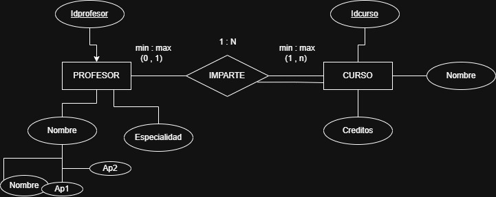
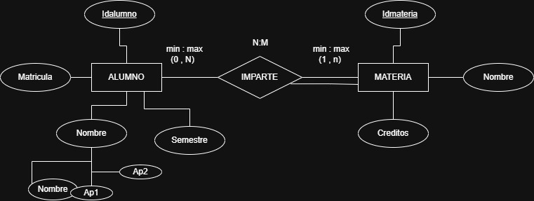
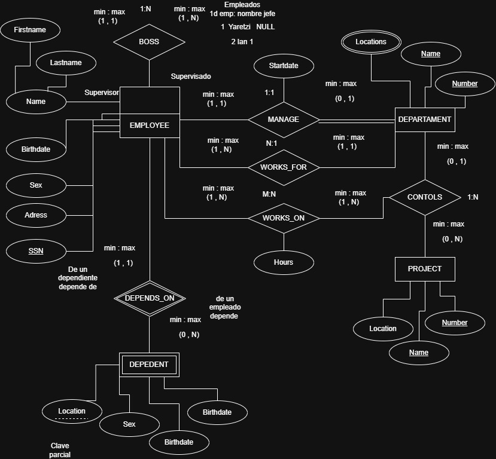

# Ejercicios MODELO E-R

En un hospital se registra información de sus pacientes
## de cada paciente se desea almacenar:
+ algo que lo identifique (no. paciente)
+ nombre
+ fecha de nacimiento
De un expediente médico se almacena:
+ no. de expe
+ fecha de apertura
+ tipo de sangre

## Regla:
1. Cada paciente debe tener exactamente un expediente médico
2. Cada expediente médico pertenece a un único paciente
3. no puede existir un expediente sin paciente
4. no puede existir un paciente sin expediente

identificar identidades, atributos, dibujar la relación, determinar la cardinalidad y participación

# Ejercicio 2
UNa universidad administra profesores y cursos
> de cada profesor se almacena:
- Clave profesor
- nombre
- especialidad

> de cada curso se almacena:
+ identificación del curso
+ nombre del curso 
+ creditos

> Reglas del negocio
1. Un profesor puede impartir varios cursos
2. Un curso sólamente puede ser impartido por un profesor
3. Puede existir un profesor que no imparta cursos.
4. Todo curso debe ser asignado a un profesor

Se debe realizar lo siguiente:
+ entidades
+ Relación **imparte**
+ Determinar la cardinalidad y participación

## Resultado

# Ejercicio 3
Una escuela administra alumnos y materias
> De cada alumno se almacena:
+ matrícula
+ nombre
+ semestre

> De cada materia se almacena:
+ clave
+ nombre
+ créditos (cuanto vale)

## Reglas del negocio
1. Un alumno puede inscribirse en varias materias.
2. Una materia puede tener muchos alumnos inscritos.
3. Puede existir una materia sin alumnos inscritos.
4. Todo alumno debe estar inscrito en al menos una materia.
5. De cada inscripción se debe akmacenar:
    + Fecha de inscripción
    + Calificación final
6. El nombre de la relación: INSCRIBE

## Resultado

# Ejercicio 4
Una empresa encargada de realizar venta de productos:

> de cada cliente se almacena:
+ un número de cliente que lo identifique
+ nombre el cual es una persona moral
+ rfc

> La empresa eraliza pedidos en los cuales almacena lo siguiente
+ numero de pedido
+ fecha

> la empresa también almacena productos de los cuales:
+ numero de producto
+ nombre
+ precio

> Al relizar los pedidos deben registrar
+ cantidad de productos pedidos
+ precio

## Reglas
1. Un cliente puede realizar muchos pedidos
2. Cada pedido pertenece a un solo cliente
3. un pedido puede conetner varios productos 
4. Un producto puede aparecer en varios pedidos
5. Un pedido debe contener al menos un produto
6. Un producto puede no haber sido vendido
7. El detalle del pedido no existe sin pedido
8. El detalle de pedido no existe sin producto
9. El detalle almacena:
    + cantidad
    + precio de venta

----

# Ejercicio 5

Una empresa está organizada en departamentos para administrar a sus empleados y proyectos.

> De cada departamento se almacena:

+ número de departamento (único)
+ nombre del departamento (único)
+ fecha de inicio de gestión del gerente

> De cada empleado se almacena:

+ número de seguro social (NSS)
+ nombre
+ dirección
+ salario
+ sexo
+ fecha de nacimiento

> La empresa administra proyectos de los cuales almacena:

+ número de proyecto (único)
+ nombre del proyecto (único)
+ ubicación

> La empresa también registra los dependientes de cada empleado para fines de seguro:

+ nombre
+ sexo
+ fecha de nacimiento
+ parentesco

> Además, cuando un empleado trabaja en un proyecto, se registra:

1. horas trabajadas por semana
2. Reglas
3. Un departamento es administrado por un solo empleado.
4. Un empleado puede administrar como máximo un departamento.
5. Un departamento puede tener varias ubicaciones.
6. Un departamento controla varios proyectos.
7. Un proyecto pertenece a un solo departamento.
8. Un empleado pertenece a un solo departamento.
9. Un departamento puede tener muchos empleados.
10. Un empleado puede trabajar en varios proyectos.
11. Un proyecto puede tener varios empleados trabajando en él.
12. En la relación entre empleado y proyecto se almacena:
13. horas trabajadas por semana
14. Cada empleado tiene un supervisor directo.
15. Un supervisor también es un empleado.
16. Un empleado puede supervisar a varios empleados.
17. Un empleado puede tener varios dependientes.
18. Un dependiente pertenece a un solo empleado.
19. Un dependiente no existe sin el empleado al que pertenece.
20. La información de la administración del departamento almacena:
21. fecha de inicio de gestión del gerente

----