# Ejercicio 1

1. Ejercicio 1. Hospital
## Modelo E-R
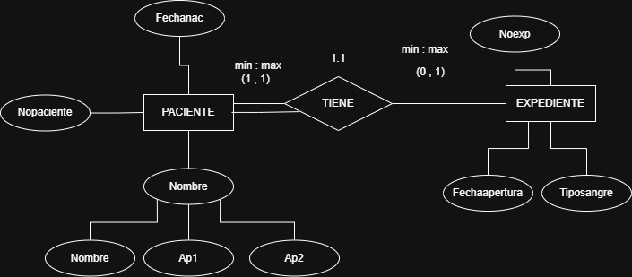

## Modelo Relacional

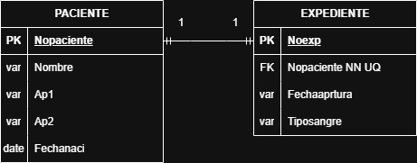

# Ejercicio 2

2. Ejercicio 2. Profesores
## Modelo E-R
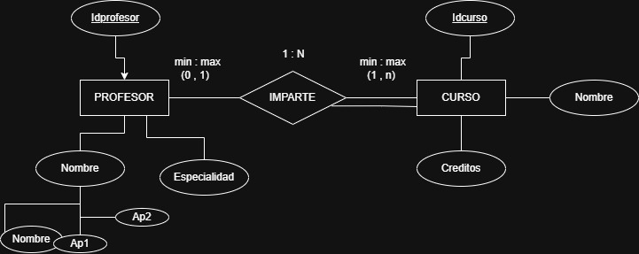

## Modelo Relacional

# Ejercicio 3

3. Ejercicio 3. Alumnos
## Modelo E-R
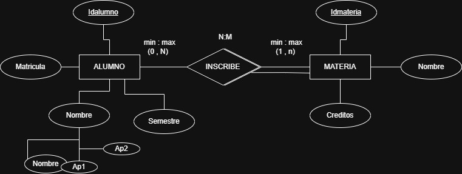

## Modelo Relacional

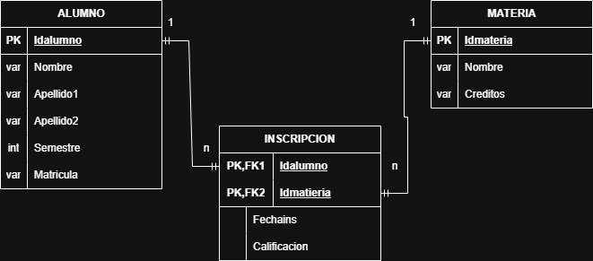

# Ejercicio 4

4. Ejercicio 4. Empresa
## Modelo E-R
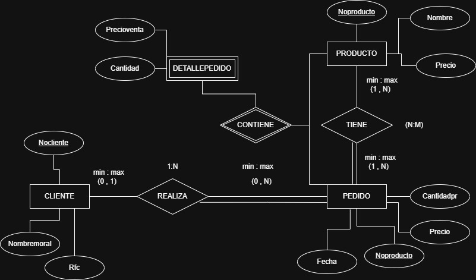

## Modelo Relacional

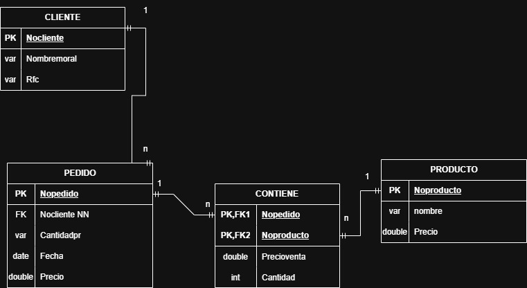

# Ejercicio 5

5. Ejercicio 5. Empresa
## Modelo E-R
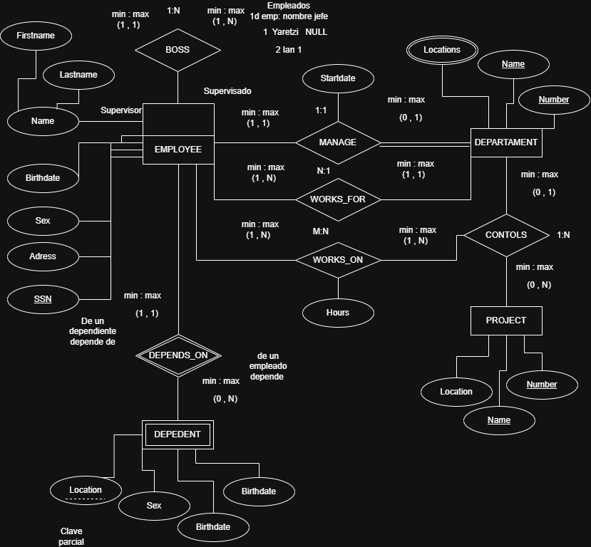

## Modelo Relacional

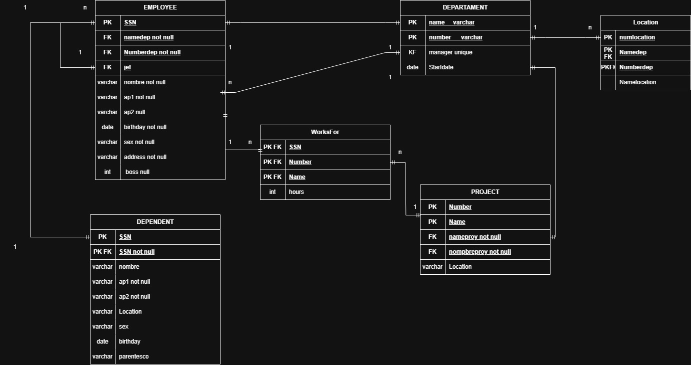

> Versión 2.0

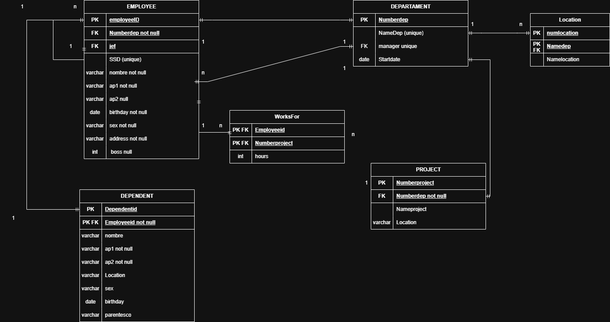

# Ejercicio 6

6. Ejercicio 6. Escuela
## Modelo E-R
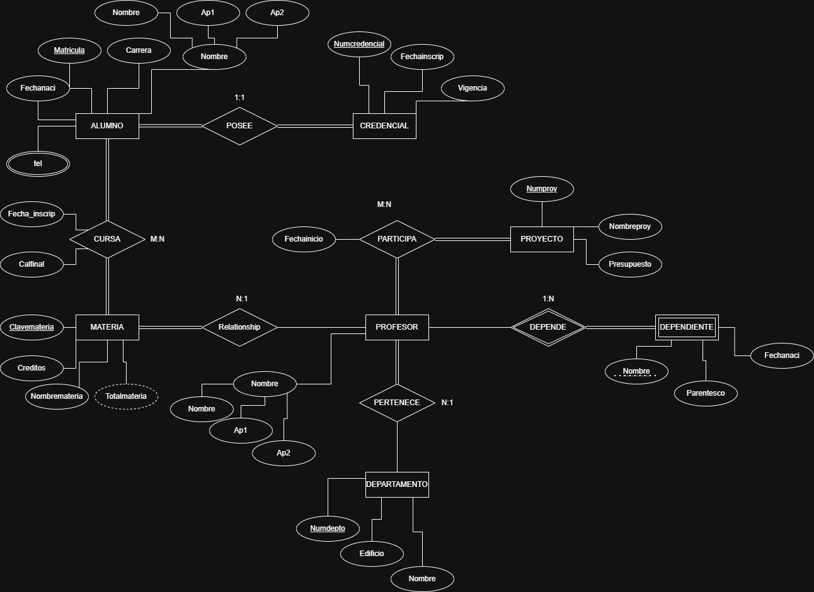

## Modelo Relacional

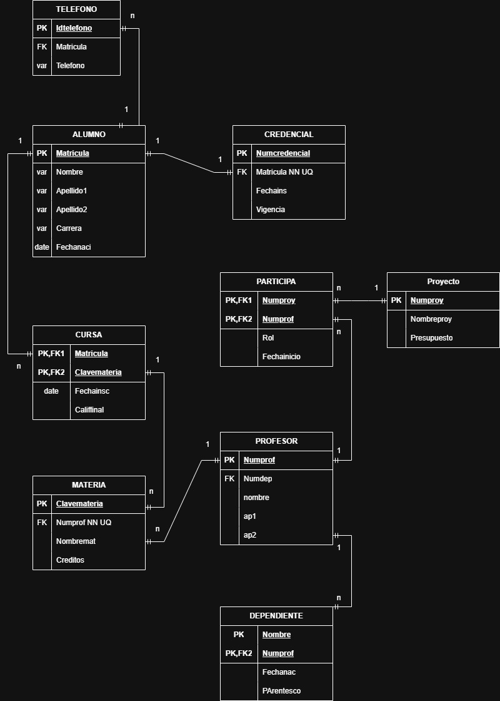

