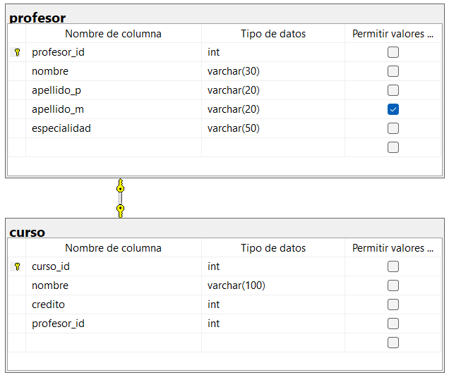

```sql
-- Crear la base de datos
CREATE DATABASE universidad;
GO

-- Usar la base de datos
USE universidad;
GO

-- Crear la tabla profesor
CREATE TABLE profesor(
	profesor_id INT NOT NULL IDENTITY(1,1),
	nombre VARCHAR (30) NOT NULL,
	apellido_p VARCHAR(20) NOT NULL,
	apellido_m VARCHAR(20),
	especialidad VARCHAR(50) NOT NULL,

	-- pk de profesor
	CONSTRAINT pk_profesor
	PRIMARY KEY (profesor_id)
);

CREATE TABLE curso(
	curso_id INT NOT NULL IDENTITY(1,1),
	nombre VARCHAR(100) NOT NULL,
	credito INT NOT NULL,
	profesor_id INT NOT NULL,

	CONSTRAINT pk_curso
	PRIMARY KEY (curso_id),

	CONSTRAINT uq_curso_profesor_id
	UNIQUE (profesor_id),
	
	CONSTRAINT fk_curso_profesor
	FOREIGN KEY (profesor_id)
	REFERENCES profesor(profesor_id)
);
```

## DIAGRAMA FINAL

