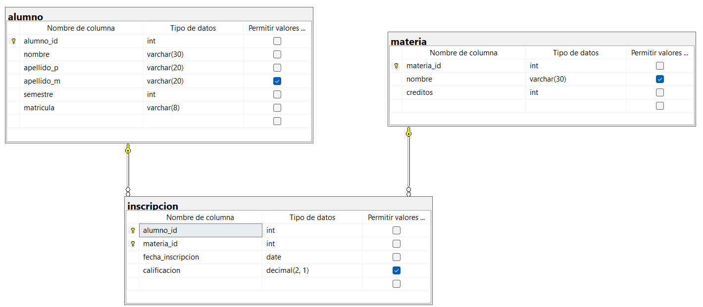

```sql
-- Crear la base de datos
CREATE DATABASE escuela;
GO

-- Usar la base de datos
USE escuela;
GO

CREATE TABLE alumno(
	alumno_id INT NOT NULL IDENTITY(1,1),
	nombre VARCHAR(30) NOT NULL,
	apellido_p VARCHAR(20) NOT NULL,
	apellido_m VARCHAR(20),
	semestre INT NOT NULL,
	matricula VARCHAR(8) NOT NULL,

	CONSTRAINT pk_alumno
	PRIMARY KEY (alumno_id),

	CONSTRAINT ck_alumno_semestre
	CHECK(semestre BETWEEN 1 AND 6),

	CONSTRAINT uq_alumno_matricula
	UNIQUE (matricula)
);
GO

CREATE TABLE materia(
	materia_id INT NOT NULL IDENTITY(1,1),
	nombre VARCHAR(30),
	creditos INT NOT NULL,

	CONSTRAINT pk_materia
	PRIMARY KEY (materia_id),

	CONSTRAINT ck_materia_creditos
	CHECK(creditos>0)
);
GO

CREATE TABLE inscripcion(
	alumno_id INT NOT NULL,
	materia_id INT NOT NULL,
	fecha_inscripcion DATE not null,
	calificacion DECIMAL (2,1)
	DEFAULT 0.0,

	CONSTRAINT ck_inscripcion_calificacion
	CHECK(calificacion BETWEEN 0.0 AND 10.0),

	CONSTRAINT pk_inscripcion
	PRIMARY KEY(alumno_id, materia_id),

	CONSTRAINT fk_incripcion_alumno
	FOREIGN KEY(alumno_id)
	REFERENCES alumno(alumno_id),

	CONSTRAINT fk_inscripcion_materia
	FOREIGN KEY(materia_id)
	REFERENCES materia(materia_id)

);


```

## DIAGRAMA FINAL

