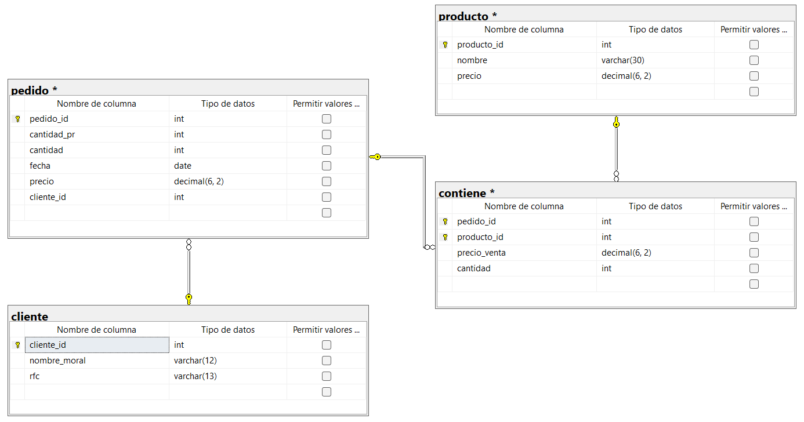

```sql
-- Crear base de datos
CREATE DATABASE empresa;
GO

USE empresa;
GO

CREATE TABLE cliente(
	cliente_id INT NOT NULL IDENTITY(1,1),
	nombre_moral VARCHAR(12) NOT NULL,
	rfc VARCHAR(13) NOT NULL

	CONSTRAINT pk_cliente
	PRIMARY KEY (cliente_id)
);
GO

CREATE TABLE pedido(
	pedido_id INT NOT NULL IDENTITY(1,1),
	cantidad_pr INT NOT NULL,
	cantidad INT NOT NULL,
	fecha DATE NOT NULL,
	precio DECIMAL (6,2),
	cliente_id INT NOT NULL,

	CONSTRAINT pk_pedido
	PRIMARY KEY (pedido_id),

	CONSTRAINT ck_pedido_precio
	CHECK(precio>0),

	CONSTRAINT fk_pedido_cliente
	FOREIGN KEY (cliente_id)
	REFERENCES cliente(cliente_id),

);
GO

CREATE TABLE producto(
	producto_id INT NOT NULL IDENTITY(1,1),
	nombre VARCHAR(30) NOT NULL,
	precio DECIMAL(6,2),
	
	CONSTRAINT pk_producto
	PRIMARY KEY (producto_id),
	
	CONSTRAINT ck_producto_precio
	CHECK(precio>0.0)
);
GO

CREATE TABLE contiene(
	pedido_id INT NOT NULL,
	producto_id INT NOT NULL,
	precio_venta DECIMAL (6,2),
	cantidad INT NOT NULL,

	CONSTRAINT pk_contiene
	PRIMARY KEY (pedido_id, producto_id),

	CONSTRAINT ck_contiene_cantidad
	CHECK(cantidad>0),

	CONSTRAINT fk_contiene_pedido
	FOREIGN KEY (pedido_id)
	REFERENCES pedido(pedido_id),

	CONSTRAINT fk_contiene_producto
	FOREIGN KEY (producto_id)
	REFERENCES producto(producto_id)
);
```

## DIAGRAMA FINAL

