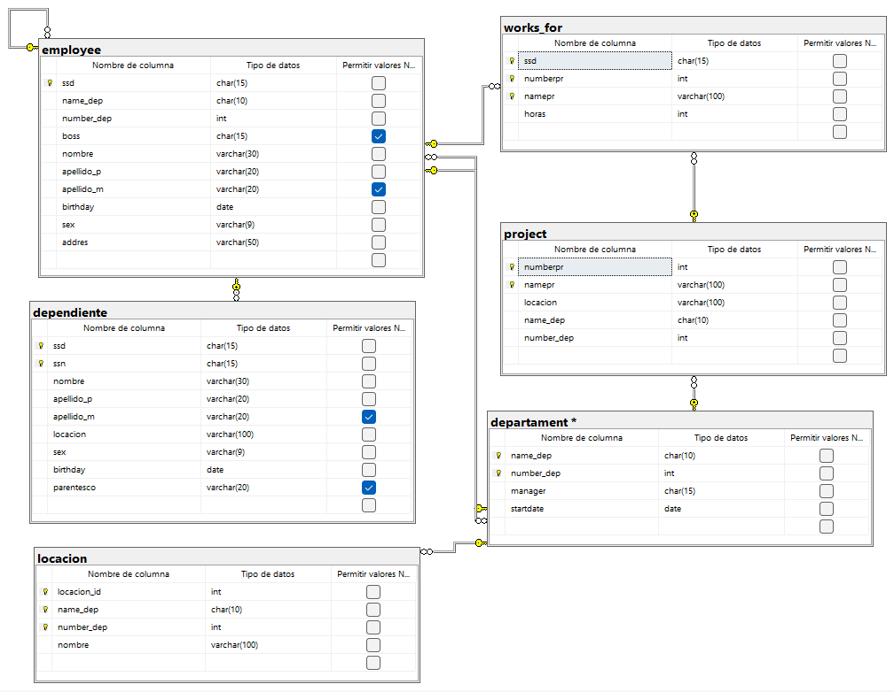

```sql
-- Crear la base de datos
CREATE DATABASE empresa_departamental;
GO

USE empresa_departamental;
GO

CREATE TABLE locacion(
	locacion_id INT NOT NULL IDENTITY(1,1),
	name_dep CHAR (10) NOT NULL,
	number_dep INT NOT NULL,
	nombre VARCHAR(100) NOT NULL,

	CONSTRAINT pk_locacion
	PRIMARY KEY (locacion_id,name_dep,number_dep)
);
GO
-- después se incluye la fk

CREATE TABLE departament(
	name_dep CHAR (10) NOT NULL,
	number_dep INT NOT NULL,
	manager CHAR(15) NOT NULL,
	startdate DATE,

	CONSTRAINT pk_departament
	PRIMARY KEY (name_dep,number_dep)
);
GO
-- después se incluye la fk de manager


ALTER TABLE locacion
ADD CONSTRAINT fk_locacion_departament
FOREIGN KEY (name_dep,number_dep)
REFERENCES departament(name_dep,number_dep);
GO

CREATE TABLE project(
	numberpr INT NOT NULL IDENTITY(1,1),
	namepr VARCHAR(100) NOT NULL,
	locacion VARCHAR(100) NOT NULL,
	name_dep CHAR (10) NOT NULL,
	number_dep INT NOT NULL,

	CONSTRAINT pk_project
	PRIMARY KEY (numberpr,namepr),

	CONSTRAINT uq_project_namepr
	UNIQUE (namepr),

	CONSTRAINT fk_project_departament
	FOREIGN KEY (name_dep,number_dep)
	REFERENCES departament(name_dep,number_dep)
	ON DELETE CASCADE
	ON UPDATE CASCADE
);
GO

CREATE TABLE works_for(
	ssd CHAR(15) NOT NULL,
	numberpr INT NOT NULL ,
	namepr VARCHAR(100) NOT NULL,
	horas INT NOT NULL,

	CONSTRAINT pk_works_for
	PRIMARY KEY (ssd,numberpr,namepr),

	CONSTRAINT ck_works_for_horas
	CHECK(horas>0),

	CONSTRAINT fk_works_for_project
	FOREIGN KEY (numberpr,namepr)
	REFERENCES project(numberpr,namepr)
	ON DELETE CASCADE
	ON UPDATE CASCADE
);
GO
-- después se agrega la fk de ssd

CREATE TABLE employee(
	ssd CHAR(15) NOT NULL,
	name_dep CHAR (10) NOT NULL,
	number_dep INT NOT NULL,
	boss CHAR (15),
	nombre VARCHAR(30) NOT NULL,
	apellido_p VARCHAR(20) NOT NULL,
	apellido_m VARCHAR(20) NULL,
	birthday DATE NOT NULL,
	sex VARCHAR(9) NOT NULL,
	addres VARCHAR(50) NOT NULL,

	CONSTRAINT pk_employee
	PRIMARY KEY (ssd),

	CONSTRAINT fk_employee_employee
	FOREIGN KEY (boss)
	REFERENCES employee(ssd)
	ON DELETE NO ACTION
	ON UPDATE NO ACTION,

	CONSTRAINT fk_employee_departament
	FOREIGN KEY (name_dep,number_dep)
	REFERENCES departament(name_dep,number_dep)

);
GO

ALTER TABLE works_for
ADD CONSTRAINT fk_works_for_employee
FOREIGN KEY (ssd)
REFERENCES employee(ssd);
GO

ALTER TABLE departament
ADD CONSTRAINT fk_departament_employee
FOREIGN KEY (manager)
REFERENCES employee(ssd);
GO

CREATE TABLE dependiente(
	ssd CHAR(15) NOT NULL,
	ssn CHAR(15) NOT NULL,
	nombre VARCHAR(30) NOT NULL,
	apellido_p VARCHAR(20) NOT NULL,
	apellido_m VARCHAR(20) NULL,
	locacion VARCHAR(100) NOT NULL,
	sex VARCHAR(9) NOT NULL,
	birthday DATE NOT NULL,
	parentesco VARCHAR(20),

	CONSTRAINT pk_dependiente
	PRIMARY KEY (ssd,ssn),

	CONSTRAINT fk_dependiente_employee
	FOREIGN KEY (ssd)
	REFERENCES employee(ssd)
	ON DELETE CASCADE
	ON UPDATE CASCADE
);

```

## DIAGRAMA FINAL

