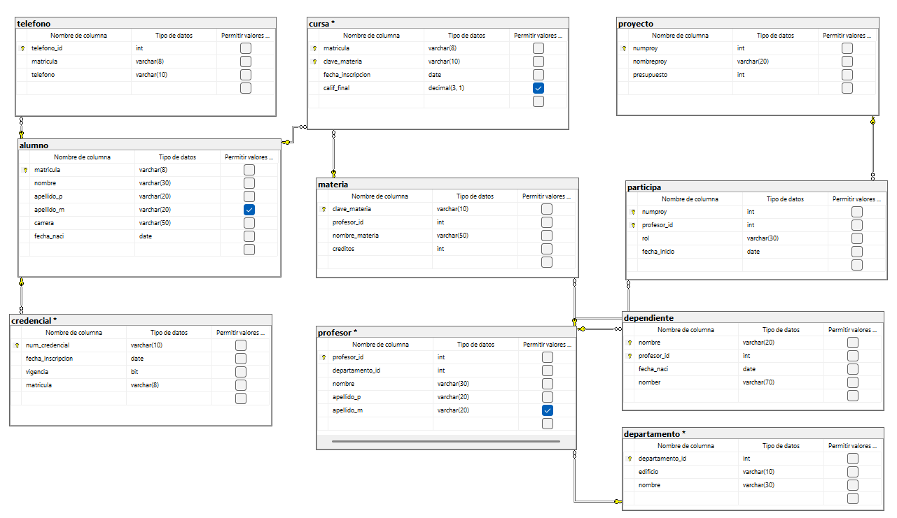

```sql
-- Crear la base de datos
CREATE DATABASE escuela_v2;
GO

USE escuela_v2;
GO

CREATE TABLE alumno(
	matricula VARCHAR(8) NOT NULL,
	nombre VARCHAR(30) NOT NULL,
	apellido_p VARCHAR(20) NOT NULL,
	apellido_m VARCHAR(20) NULL,
	carrera VARCHAR(50) NOT NULL,
	fecha_naci DATE NOT NULL,

	CONSTRAINT pk_alumno
	PRIMARY KEY (matricula)
);
GO

CREATE TABLE telefono(
	telefono_id INT NOT NULL IDENTITY(1,1),
	matricula VARCHAR(8) NOT NULL,
	telefono VARCHAR(10) NOT NULL,

	CONSTRAINT pk_telefono
	PRIMARY KEY (telefono_id),

	CONSTRAINT fk_telefono_alumno
	FOREIGN KEY (matricula)
	REFERENCES alumno(matricula)
);
GO

CREATE TABLE credencial(
	num_credencial VARCHAR(10) NOT NULL,
	fecha_inscripcion DATE NOT NULL,
	vigencia BIT 
	DEFAULT 0 NOT NULL,
	matricula VARCHAR(8) NOT NULL,

	CONSTRAINT pk_credencial
	PRIMARY KEY (num_credencial),

	CONSTRAINT fk_credencial_alumno
	FOREIGN KEY (matricula)
	REFERENCES alumno(matricula)
);
GO

CREATE TABLE departamento(
	departamento_id INT NOT NULL,
	edificio VARCHAR(10) NOT NULL,
	nombre VARCHAR(30) NOT NULL,

	CONSTRAINT pk_departamento
	PRIMARY KEY (departamento_id)
);
GO

CREATE TABLE profesor(
	profesor_id INT NOT NULL,
	departamento_id INT NOT NULL,
	nombre VARCHAR(30) NOT NULL,
	apellido_p VARCHAR(20) NOT NULL,
	apellido_m VARCHAR(20) NULL,

	CONSTRAINT pk_profesor
	PRIMARY KEY (profesor_id),

	CONSTRAINT fk_profesor_departamento
	FOREIGN KEY (departamento_id)
	REFERENCES departamento(departamento_id)
);
GO

CREATE TABLE dependiente(
	nombre VARCHAR(20) NOT NULL,
	profesor_id INT NOT NULL,
	fecha_naci DATE NOT NULL,
	nomber VARCHAR(70) NOT NULL,

	CONSTRAINT pk_dependiente
	PRIMARY KEY (nombre,profesor_id),

	CONSTRAINT fk_dependiente_profesor
	FOREIGN KEY (profesor_id)
	REFERENCES profesor(profesor_id)
);
GO

CREATE TABLE proyecto(
	numproy INT NOT NULL,
	nombreproy VARCHAR(20) NOT NULL,
	presupuesto INT NOT NULL,

	CONSTRAINT pk_proyecto
	PRIMARY KEY (numproy),

	CONSTRAINT uq_proyecto_nombreproy
	UNIQUE (nombreproy)
);
GO

CREATE TABLE participa(
	numproy INT NOT NULL,
	profesor_id INT NOT NULL,
	rol VARCHAR(30) NOT NULL,
	fecha_inicio DATE NOT NULL,

	CONSTRAINT pk_participa
	PRIMARY KEY (numproy,profesor_id),

	CONSTRAINT fk_participa_proyecto
	FOREIGN KEY (numproy)
	REFERENCES proyecto(numproy),

	CONSTRAINT fk_participa_profesor
	FOREIGN KEY (profesor_id)
	REFERENCES profesor(profesor_id)
);
GO

CREATE TABLE materia(
	clave_materia VARCHAR(10) NOT NULL,
	profesor_id INT NOT NULL,
	nombre_materia VARCHAR(50) NOT NULL,
	creditos INT NOT NULL,

	CONSTRAINT pk_materia
	PRIMARY KEY (clave_materia),

	CONSTRAINT fk_materia_profesor
	FOREIGN KEY (profesor_id)
	REFERENCES profesor(profesor_id)
);
GO

CREATE TABLE cursa(
	matricula VARCHAR(8) NOT NULL,
	clave_materia VARCHAR(10) NOT NULL,
	fecha_inscripcion DATE NOT NULL,
	calif_final DECIMAL(3,1) NULL,

	CONSTRAINT pk_cursa
	PRIMARY KEY (matricula,clave_materia),

	CONSTRAINT fk_cursa_alumno
	FOREIGN KEY (matricula)
	REFERENCES alumno(matricula),

	CONSTRAINT fk_cursa_materia
	FOREIGN KEY (clave_materia)
	REFERENCES materia(clave_materia),

	CONSTRAINT ck_cursa_calif_final
	CHECK(calif_final BETWEEN 0 AND 10)
);
```

## DIAGRAMA FINAL

