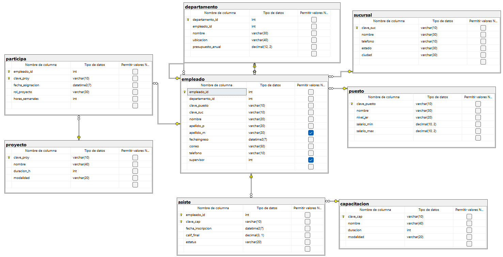

```sql
-- Crear la base de datos
CREATE DATABASE empresa_v9
GO

-- Usar la base de datos
USE empresa_v9;
GO

-- Tabla PUESTO
CREATE TABLE puesto(
	clave_puesto VARCHAR(10) NOT NULL,
	nombre VARCHAR(30) NOT NULL,
	nivel_jer VARCHAR(20) NOT NULL,
	salario_min DECIMAL(10,2) NOT NULL,

	salario_max DECIMAL(10,2) NOT NULL,

	CONSTRAINT pk_puesto
	PRIMARY KEY (clave_puesto),

	CONSTRAINT ck_puesto_salario_min
	CHECK(salario_min>0.0),

	CONSTRAINT ck_puesto_salario_max
	CHECK(salario_max>=salario_min)
);
GO

-- Tabla SUCURSAL
CREATE TABLE sucursal(
	clave_suc VARCHAR(10) NOT NULL,
	nombre VARCHAR(30) NOT NULL,
	telefono VARCHAR(10) NOT NULL,
	estado VARCHAR(30) NOT NULL,
	ciudad VARCHAR(30) NOT NULL,

	CONSTRAINT pk_sucursal
	PRIMARY KEY (clave_suc)
);
GO

-- Tabla PROYECTO
CREATE TABLE proyecto(
	clave_proy VARCHAR(10) NOT NULL,
	nombre VARCHAR(40) NOT NULL,
	duracion_h INT NOT NULL,
	modalidad VARCHAR(20) NOT NULL,

	CONSTRAINT pk_proyecto
	PRIMARY KEY (clave_proy),
	
	CONSTRAINT ck_proyecto_duracion_h
	CHECK(duracion_h>0)
);
GO

-- Tabla CAPACITACION
CREATE TABLE capacitacion(
	clave_cap VARCHAR(10) NOT NULL,
	nombre VARCHAR(40) NOT NULL,
	duracion INT NOT NULL,
	modalidad VARCHAR(20) NOT NULL,

	CONSTRAINT pk_capacitacion
	PRIMARY KEY (clave_cap),

	CONSTRAINT ck_capacitacion_duracion
	CHECK(duracion>0)
);
GO

-- Tabla DEPARTAMENTO
CREATE TABLE departamento(
	departamento_id INT NOT NULL IDENTITY(1,1),
	empleado_id INT NOT NULL,
	nombre VARCHAR(30) NOT NULL,
	ubicacion VARCHAR(40) NOT NULL,
	presupuesto_anual DECIMAL(12,2) NOT NULL,

	CONSTRAINT pk_departamento
	PRIMARY KEY (departamento_id),

	CONSTRAINT ck_departamento_presupuesto_anual
	CHECK(presupuesto_anual>0.0)
);
GO

-- Tabla EMPLEADO
CREATE TABLE empleado(
	empleado_id INT NOT NULL IDENTITY(1,1),
	departamento_id INT NOT NULL,
	clave_puesto VARCHAR(10) NOT NULL,
	clave_suc VARCHAR(10) NOT NULL,
	nombre VARCHAR(20) NOT NULL,
	apellido_p VARCHAR(20) NOT NULL,
	apellido_m VARCHAR(20),
	fechaingreso DATETIME2 NOT NULL
	CONSTRAINT df_empleado_fechaingreso
	DEFAULT SYSDATETIME(),

	correo VARCHAR(50) NOT NULL,
	telefono VARCHAR(10) NOT NULL,
	supervisor INT,

	CONSTRAINT pk_empleado
	PRIMARY KEY (empleado_id),

	CONSTRAINT fk_empleado_puesto
	FOREIGN KEY (clave_puesto)
	REFERENCES puesto(clave_puesto),

	CONSTRAINT fk_empleado_sucursal
	FOREIGN KEY (clave_suc)
	REFERENCES sucursal(clave_suc),

	CONSTRAINT fk_empleado_empleado
	FOREIGN KEY (supervisor)
	REFERENCES empleado(empleado_id)
);
GO

-- Agregar FOREIGN KEY a tabla departamento 

ALTER TABLE departamento
ADD CONSTRAINT fk_departamento_empleado
FOREIGN KEY (empleado_id)
REFERENCES empleado(empleado_id);
GO

-- Agregar FOREIGN KEY a la tabla empleado que viene de departamento

ALTER TABLE empleado
ADD CONSTRAINT fk_empleado_departamento
FOREIGN KEY (departamento_id)
REFERENCES departamento(departamento_id);
GO

-- Tabla PARTICIPA

CREATE TABLE participa(
	empleado_id INT NOT NULL,
	clave_proy VARCHAR(10) NOT NULL,
	fecha_asignacion DATETIME2 NOT NULL
	CONSTRAINT df_participa_fecha_asignacion
	DEFAULT SYSDATETIME(),
	rol_proyecto VARCHAR(30) NOT NULL,
	horas_semanales INT NOT NULL,

	CONSTRAINT pk_participa
	PRIMARY KEY (empleado_id,clave_proy),

	CONSTRAINT fk_participa_empleado
	FOREIGN KEY (empleado_id)
	REFERENCES empleado(empleado_id),

	CONSTRAINT fk_participa_proyecto
	FOREIGN KEY (clave_proy)
	REFERENCES proyecto(clave_proy),

	CONSTRAINT ck_participa_horas_semanales
	CHECK(horas_semanales>0)
);
GO

-- Tabla ASISTE

CREATE TABLE asiste(
	empleado_id INT NOT NULL,
	clave_cap VARCHAR(10) NOT NULL,

	fecha_inscripcion DATETIME2 NOT NULL
	CONSTRAINT df_asiste_fecha_inscripcion
	DEFAULT SYSDATETIME(),

	calif_final DECIMAL(3,1) NOT NULL
	CONSTRAINT ck_asiste_calif_final
	CHECK(calif_final BETWEEN 0.0 AND 10.0),

	estatus VARCHAR(20) NOT NULL,

	CONSTRAINT pk_asiste
	PRIMARY KEY (empleado_id,clave_cap),

	CONSTRAINT fk_asiste_empleado
	FOREIGN KEY (empleado_id)
	REFERENCES empleado(empleado_id),

	CONSTRAINT fk_asiste_capacitacion
	FOREIGN KEY (clave_cap)
	REFERENCES capacitacion(clave_cap)
);
GO
```

## DIAGRAMA FINAL

